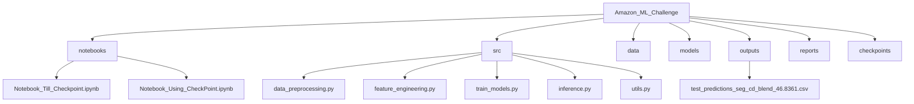
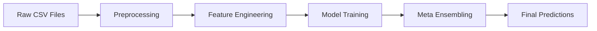

# Amazon_ML_Challenge_2025

## Overview
This repository contains the full implementation of our solution for the **Amazon ML Challenge 2025**.  
The problem involves predicting optimal product prices using a multimodal dataset consisting of text, images, and structured metadata.  
The core metric is **SMAPE (Symmetric Mean Absolute Percentage Error)**.

---

## Repository Structure


## Environment Setup
``` bash
# clone repository
git clone https://github.com/<your_username>/Amazon_ML_Challenge.git
cd Amazon_ML_Challenge
```
# create environment
python3 -m venv venv
source venv/bin/activate     # Linux / macOS
venv\Scripts\activate        # Windows

# install dependencies
``` bash
pip install -r requirements.txt
```

## Requirements
``` bash
python==3.10
numpy>=1.26
pandas>=2.0
scikit-learn>=1.5
xgboost>=2.0
lightgbm>=4.0
faiss-cpu
sentence-transformers
open_clip_torch
matplotlib
seaborn
```
## Problem Description
Input:

title, description, and product_type (text features)

image_link (image features)

categorical features like brand, segment, etc.

continuous features like rating, discount, etc.

Output:

Predicted price value (float)

Metric: SMAPE=(100/N)∗Σ(∣yp​red−yt​rue∣/((∣yp​red∣+∣yt​rue∣)/2))

## Data Flow

Pipeline Explanation
1. Data Preprocessing

Handle missing values in text and image fields.

Replace zero or invalid prices with median of segment.

Apply logarithmic transformation for price normalization.

Stratified K-Fold based on log(price) bins.

2. Feature Engineering

Text: TF-IDF and Sentence Transformer (e5-large-v2)

Image: OpenCLIP ViT-L/14 and ViT-B/32 embeddings

Categorical: Frequency encoding for brand/segment

Numerical: Z-score normalization

Interactions: price × brand_freq, embedding_distance, etc.

3. Modeling
Model	Description
Ridge Regression	Text-only TF-IDF baseline
LightGBM	Structured + Text embedding model
XGBoost	Feature-interaction learning
FAISS kNN	Similarity-based image price priors
Residual Booster	Meta-level model combining all base predictions

Training was done using 5-fold stratified CV, optimizing directly on SMAPE.

4. Ensembling

OOF predictions from each model are stacked.

A final meta-regressor (XGBoost) learns optimal blending weights.

Segment-level isotonic regression applied for calibration.

Segment and cluster-based final blending applied to improve consistency.

## License
This project is distributed under the MIT License.

## Authors
Aryan Kumar, NIT Goa

## Acknowledgements

Amazon ML Challenge 2025

LAION / OpenCLIP team

Sentence-Transformers (e5-large-v2)

XGBoost & LightGBM open-source contributors